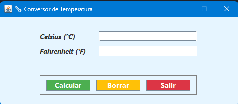

<div align="center">



</div>

# 🌡️ Conversor de Temperaturas

Aplicación de escritorio desarrollada en Java utilizando Swing, que permite convertir temperaturas entre Celsius (°C) y Fahrenheit (°F).

La aplicación cuenta con validaciones para los valores ingresados y una interfaz gráfica sencilla e intuitiva.

## ✨ Funcionalidades
- Conversión de Celsius a Fahrenheit.
- Conversión de Fahrenheit a Celsius.
- Validación de campos vacíos.
- Validación de valores numéricos.
- Validación de valores negativos.
- Bloqueo del campo contrario mientras se introduce una temperatura.
- Limpieza de los campos mediante el botón Borrar.
- Cierre de la aplicación mediante el botón Salir.
- Mensajes de error para entradas inválidas.

## 📐 Fórmulas de conversión
- Celsius → Fahrenheit <br>
  °F = (°C × 1.8) + 32

- Fahrenheit → Celsius <br>
  °C = (°F - 32) / 1.8

## 🛠️ Tecnologías utilizadas
- 
- Java Swing

## 📂 Estructura del proyecto
```bash
ConversorTemperaturas/
│
├── src/
│   └── Ventana.java
│   └── Principal.java
│
├── images/
│   ├── ventana-principal.png
│   ├── celsius-fahrenheit.png
│   ├── fahrenheit-celsius.png
│   └── validacion.png
│
├── .gitignore
└── README.md
```

## ▶️ Ejecución
Requisitos

Para ejecutar el proyecto es necesario contar con:

- Java JDK 8 o superior
- Un IDE compatible con Java

### Ejecutar el proyecto
- Clonar el repositorio: <br>
  ```bash
  git clone https://github.com/LaloSP-dev/Fahrenheit-Celsius.git
  ```
- Abrir el proyecto en el IDE.
- Ejecutar la clase que contiene el método main.
- La ventana del conversor se mostrará automáticamente.


## 🔎 Validaciones

La aplicación verifica que los datos introducidos sean correctos antes de realizar una conversión.

Entre las validaciones implementadas se encuentran:

- Ambos campos no pueden estar vacíos.
- El valor introducido debe ser numérico.
- Se permiten valores negativos.
- Solo uno de los campos debe contener un valor para realizar la conversión.

Si se introduce un valor incorrecto, la aplicación muestra un mensaje de error indicando el problema.

## 🎯 Objetivo del proyecto

El objetivo de este proyecto es practicar los fundamentos de Java Swing y la programación orientada a eventos, utilizando componentes gráficos y manejadores de eventos para crear una aplicación de escritorio funcional.

Durante el desarrollo se aplicaron conceptos como:

- Creación de interfaces gráficas.
- Manejo de eventos.
- Validación de datos.
- Conversión de tipos de datos.
- Uso de componentes de Swing.
- Programación orientada a objetos.

## 👤 Autor

Eduardo Sánchez Pascual

Licenciado en Computación.
